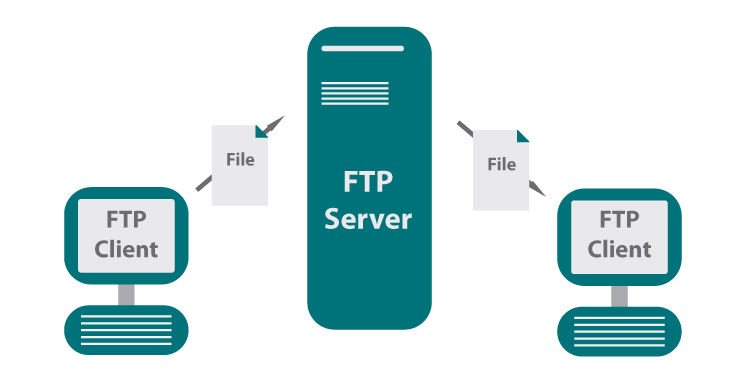
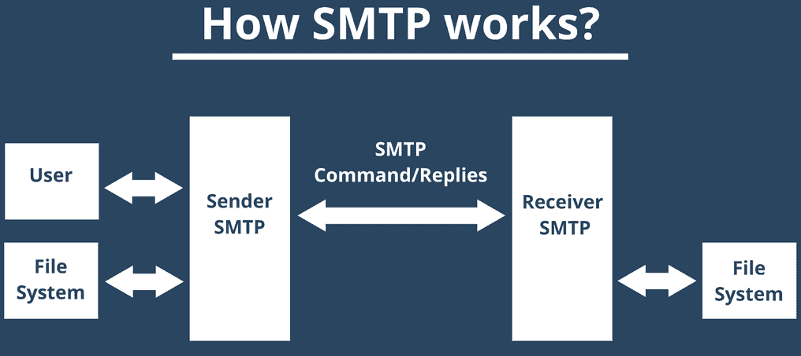

# Online JPEG File Compression Tool

This project is aimed at users who want to compress their JPEG files (file size &lt; 50Mb) to a specific size. After compression, we allow the users to either download the file from our server or get the files sent to their email address. This is a user-friendly web application in Python.

We use FTP (File Transfer Protocol) for upload and download of the file and SMTP (Simple Mail Transfer Protocol) for sending the file via email.

**FTP** is a standard communication protocol used for the transfer of computer files from a server to a client on a computer network. FTP is built on a client–server model architecture using separate control and data connections between the client and the server.

**SMTP** is a set of communication guidelines that allow software to transmit an electronic mail over the internet. This protocol allows applications to send and receive emails.

## Modules for the project

1. **File Upload**: The user can upload a .jpeg file and it will be sent to the server for compression.
2. **File Download**: Allows the user to download the file after compression.
3. **Server**: Compresses the files it recieves and sends it back to the client. Optionally if the uploader chooses to send the file to a specific email address, the server will ask for the email address first.

## Software

**Language Stack**: Python, HTML, CSS

**Frameworks**: Flask(backend), Django

**Development Tools**: Atom, VS Code, Cloud Hosting with Heroku
